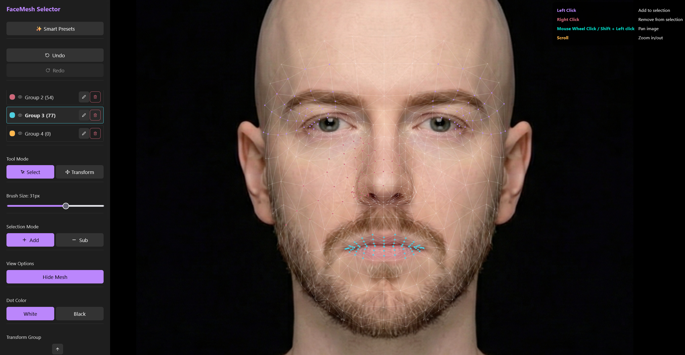

# MediaPipe FaceMesh Landmark Selector

A **React-based visual tool** for selecting, grouping, and exporting **MediaPipe Face Mesh landmarks** on custom images.

This app lets you **interactively pick from the 468 FaceMesh points**, organize them into reusable groups, and export clean JSON configurations for use in masks, filters, AR effects, or face analysis pipelines.



---

## 📚 Documentation

Detailed documentation is available in the `docs` folder:
- **[User Manual (how_to_use.md)](docs/how_to_use.md)**: A complete walkthrough of controls, canvas navigation, selection tools, and the new interactive **Transform (Drag) Mode**.
- **[Data Export Guide (export.md)](docs/export.md)**: Details the structure, mathematics, and code formats for exported indices and modified coordinates (normalized and pixel spaces).

---

## Why this tool?

If you’ve worked with **MediaPipe FaceMesh**, you already know the pain:

- The face mesh has **468 landmarks**
- The official diagrams are **static and hard to interpret**
- Selecting landmark indices usually means:
  - Trial-and-error
  - Printing reference images
  - Guessing numbers
  - Writing temporary debug overlays
  - Repeating the process every time

### Common real-world problems this tool solves

#### 🎭 Face Masks & Filters
Want to build:
- Lipstick masks
- Eye shadow regions
- Face paint
- Beard or makeup filters

You need **exact landmark indices** for lips, eyelids, cheeks, and jawlines.  
This tool lets you **paint regions directly on the face** and export them as JSON.

#### 🤖 Face Analysis & Research
Perfect for:
- Emotion detection
- Facial symmetry analysis
- Region-based metrics
- Custom landmark clustering

Create **named, reusable landmark groups** with visual verification.

#### 🎮 AR / WebGL / Three.js Pipelines
Select landmarks for:
- Face-attached meshes
- Deformation zones
- UV mapping
- Face-following geometry

Export clean data ready for rendering pipelines.

#### 🧪 Prototyping & Debugging
Stop guessing landmark numbers.  
**See exactly what each index represents, instantly.**

---

## Features

### 🧠 Face Landmark Detection
- Automatically detects **468 MediaPipe Face Mesh landmarks**
- Works with custom uploaded images

### 🗂 Multi-Group Selection
- Create unlimited groups
- Rename, delete, customize color
- Toggle visibility per group to isolate selections

### 🎨 Visual Selection & Mesh Editing
- **Brush Select**: Click & drag to select points, or right-click to subtract.
- **Transform (Drag) Mode**: Directly drag points on the canvas to adjust coordinates.
- **🪞 Symmetric Drag Toggle**: Mirror landmark adjustments on the opposite side of the face topologically.
- **✨ Smart Presets**: Instantly load points for Eyes, Lips, Eyebrows, and Face Oval.
- **🔄 Undo/Redo**: Full history support for selection changes.
- **Zoom & Pan**: Smooth scroll wheel zoom and click-and-drag panning.
- **Mesh Wireframe Toggle**: Overlay the FaceMesh triangulation grid.
- **Hover Tooltip**: Inspect landmark index numbers under the mouse instantly.
- **Specular Mirroring & Inverse Selection**: One-click actions on selection groups.

### 💾 Workspace Auto-Save (Persistence)
- Automatically saves all groups, active selections, visibility, colors, and coordinates to the browser's `localStorage` in real time.
- Recover your editor state instantly upon browser refresh.

### 📦 Multi-Format Export
- **Indices-Only**: Export groups as JSON, CSV, or TXT.
- **Coordinates (Includes Offset Nudges)**: Export absolute pixel coordinates ($x, y, z$) or normalized coordinates ($x, y, z$) as JSON or CSV.
- **JSON Import**: Reload previous configurations directly back into the editor.

### 🖼 Image Support
- Upload custom images
- Default image included for testing

---

## Example Use Cases

### Example Export Structure

The exported JSON is a dictionary where keys are group names and values are arrays of landmark indices.

```json
{
  "Upper Lip": [61, 185, 40, 39, 37, 0, 267, 269, 270, 409, 291],
  "Lower Lip": [146, 91, 181, 84, 17, 314, 405, 321, 375, 291],
  "Left Eye": [33, 246, 161, 160, 159, 158, 157, 173, 133, 155, 154, 153],
  "Nose Tip": [1]
}
```

---

## Tech Stack

- **Framework**: React 19 + Vite
- **Language**: TypeScript
- **Face Detection**: MediaPipe Face Mesh
- **Styling**: CSS Modules + Tailwind
- **Icons**: Lucide React

---

## Getting Started

### Prerequisites
- Node.js v18+
- npm or yarn

### Installation
```bash
git clone https://github.com/robertobalestri/FaceMesh-Landmark-Selector.git
cd FaceMesh-Landmark-Selector
npm install
```

### Development
```bash
npm run dev
```

Open http://localhost:5173

---

## Usage

1. Upload an image
2. Create selection groups
3. Brush-select landmarks
4. Refine with symmetry and visibility
5. Export JSON

---

## Roadmap
- [x] **Undo/Redo History**: Robust state management for selection changes.
- [x] **Smart Presets**: Quickly select common regions (Lips, Eyes, Eyebrows, Face Oval).
- [x] **Wireframe Mode**: Visualize the face mesh triangulation connections.
- [x] **Local Storage Auto-Save**: Workspace session auto-save and restore.
- [x] **Direct Landmark Warping**: Mouse drag-and-drop point translation.
- [x] **Symmetric Specular Drag**: Anatomically exact topological mirroring.
- [ ] **Split-screen WebGL 3D View**: Live Three.js head mesh projection viewport.
- [ ] **AR Export Profiles**: Engine-specific configurations (Spark AR, Lens Studio, TikTok).
- [ ] **478 Attention Mesh**: High-resolution iris and pupil landmarks.
- [ ] **Lasso Selection**: Freeform select grouping.

---

## License

MIT
